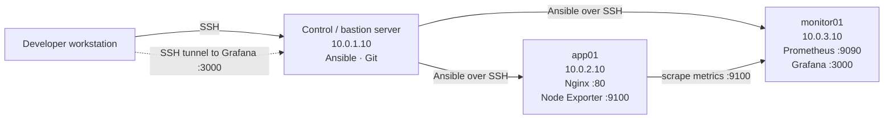

# AWS Ansible DevOps Monitoring Lab

A hands-on DevOps lab that deploys a containerized Nginx application and a private monitoring stack in AWS. Ansible, running from a control/bastion server, configures the application and monitoring hosts; Prometheus collects host metrics from Node Exporter and Grafana visualizes them.

The project is intentionally small enough to understand end-to-end while demonstrating the core building blocks of a production-style workflow: segmented AWS networking, bastion-based access, configuration management, Docker workloads, and observability.

## Architecture



## AWS network layout

| Layer | CIDR / address | Role |
| --- | --- | --- |
| VPC | `10.0.0.0/16` | Lab network |
| Public subnet | `10.0.1.0/24` | Control/bastion server: `10.0.1.10` |
| Application subnet | `10.0.2.0/24` | `app01`: `10.0.2.10` |
| Monitoring subnet | `10.0.3.0/24` | `monitor01`: `10.0.3.10` |

The public subnet uses an Internet Gateway. The application and monitoring subnets are private and use a NAT Gateway for outbound connectivity such as package and container-image downloads.

## Technology stack

- **AWS:** VPC, public/private subnets, Internet Gateway, NAT Gateway, security groups, EC2
- **Linux:** Ubuntu hosts administered through SSH
- **Automation:** Ansible and the `community.docker` collection
- **Containers:** Docker
- **Application:** Nginx serving a static lab page
- **Monitoring:** Node Exporter, Prometheus, Grafana
- **Source control:** Git and GitHub

## Repository structure

```text
.
├── inventory.ini                         # app and monitoring host inventory
├── requirements.yml                      # Ansible collection dependency
├── site.yml                              # Full deployment entry point
├── setup.yml                             # Common host configuration
├── deploy-nginx.yml                      # Nginx container on app01
├── deploy-node-exporter.yml              # Node Exporter on app01
├── deploy-prometheus.yml                 # Prometheus on monitor01
├── deploy-grafana.yml                    # Grafana on monitor01
├── files/
│   ├── nginx/index.html                  # Application page mounted in Nginx
│   ├── prometheus.yml                    # Prometheus scrape configuration
│   └── grafana/provisioning/datasources/
│       └── prometheus.yml                # Provisioned Grafana datasource
└── README.md
```

## Prerequisites

Before running the playbooks, prepare the lab environment:

- An AWS account and the VPC/subnet layout shown above (the repository documents `us-east-1`).
- One reachable control/bastion host and two private Ubuntu hosts at the inventory addresses, or an updated inventory that reflects your own addresses.
- Ansible and Git on the control server.
- Docker Engine installed on `app01` and `monitor01`, plus the Python Docker SDK required by the `community.docker` Ansible modules. `setup.yml` starts and enables Docker; it does **not** install it.
- SSH connectivity from the control server to both private hosts as `ubuntu`.
- The SSH private-key file available on the control server at the path configured in `inventory.ini` (currently `/home/ubuntu/cloud-lab-key.pem`), or an updated inventory path.

Do not commit private keys, passwords, `.env` files, tokens, or other credentials. The included `.gitignore` excludes common key and secret-file patterns.

## Deploy the lab

Clone the repository on the control server and change into it:

```bash
git clone https://github.com/shashank-jumbarthi/aws-ansible-devops-lab.git
cd aws-ansible-devops-lab
```

Review `inventory.ini` before deploying. It defines `app01` as `10.0.2.10`, `monitor01` as `10.0.3.10`, and the `ubuntu` SSH user.

Install the collection declared by the project:

```bash
ansible-galaxy collection install -r requirements.yml
```

Confirm Ansible can reach the managed hosts:

```bash
ansible all -i inventory.ini -m ping
```

Run the complete deployment:

```bash
ansible-playbook -i inventory.ini site.yml
```

`site.yml` imports the common setup playbook followed by the Nginx, Node Exporter, Prometheus, and Grafana deployments. The Docker containers are configured with `unless-stopped` restart policies. Prometheus and Grafana share the `monitoring` Docker network; Grafana receives a provisioned Prometheus datasource at `http://prometheus:9090`.

For focused iteration, individual playbooks can be run directly:

```bash
ansible-playbook -i inventory.ini deploy-nginx.yml
ansible-playbook -i inventory.ini deploy-node-exporter.yml
ansible-playbook -i inventory.ini deploy-prometheus.yml
ansible-playbook -i inventory.ini deploy-grafana.yml
```

## Verify services

From the control server, confirm the expected containers are running:

```bash
ansible app -i inventory.ini -b -a 'docker ps'
ansible monitor -i inventory.ini -b -a 'docker ps'
```

Expected services:

| Host | Service | Port |
| --- | --- | --- |
| `app01` | Nginx | `80` |
| `app01` | Node Exporter | `9100` |
| `monitor01` | Prometheus | `9090` |
| `monitor01` | Grafana | `3000` |

Useful checks from within the VPC or through the control server:

```bash
curl http://10.0.2.10
curl http://10.0.2.10:9100/metrics
curl http://10.0.3.10:9090/-/ready
```

In Prometheus, verify that the `app01` target is **UP**. Its target is defined in [`files/prometheus.yml`](files/prometheus.yml) as `10.0.2.10:9100`, with a 15-second scrape interval.

## Monitoring flow

```text
Node Exporter on app01 (10.0.2.10:9100)
              │
              ▼
Prometheus on monitor01 (10.0.3.10:9090)
              │
              ▼
Grafana on monitor01 (10.0.3.10:3000)
```

Node Exporter exposes operating-system metrics such as CPU, memory, disk, network, system load, and uptime. Prometheus scrapes those metrics and Grafana queries Prometheus through its pre-provisioned datasource. A Node Exporter Full dashboard can then be imported in Grafana to visualize the data.

## Access through the bastion

The app and monitoring instances remain private. Reach them through the control/bastion server rather than assigning public IP addresses.

To open an SSH session to a private host from a workstation that supports OpenSSH jump hosts:

```bash
ssh -i /path/to/cloud-lab-key.pem -J ubuntu@<CONTROL_SERVER_PUBLIC_IP> ubuntu@10.0.2.10
```

To access Grafana locally without exposing port `3000` publicly, create a tunnel from the workstation:

```bash
ssh -i /path/to/cloud-lab-key.pem -L 3000:10.0.3.10:3000 ubuntu@<CONTROL_SERVER_PUBLIC_IP>
```

Keep that connection open, then browse to `http://localhost:3000`. Use the Grafana account created or configured for your own deployment; do not place credentials in the repository.

## Security design

- Only the control/bastion instance needs a public-facing SSH path; `app01` and `monitor01` do not require public IP addresses.
- The control server is the Ansible control plane and SSH access path to private hosts.
- Security groups should use least privilege: allow SSH to the bastion only from trusted administration IPs; allow SSH from the bastion to private hosts; allow Prometheus on `monitor01` to reach Node Exporter on `app01:9100`.
- Keep Nginx, Prometheus, and Grafana ports private unless a deliberate access pattern is configured.
- Use SSH port forwarding to reach Grafana rather than exposing its UI to the internet.
- Keep key material and secrets out of version control. Rotate any credential that is accidentally exposed.

## Troubleshooting

| Symptom | Check |
| --- | --- |
| `ansible ... -m ping` fails | Confirm the private IPs, `ansible_user`, key path, SSH permissions, routes, and security-group rules in `inventory.ini`. |
| Docker module errors | Confirm the `community.docker` collection is installed, Docker Engine is installed/running, and the managed host has the Python Docker SDK. |
| Nginx is unavailable | On `app01`, run `docker ps`; then confirm port `80` is allowed from the required private source. |
| Prometheus target is down | Verify `curl http://10.0.2.10:9100/metrics` from the monitoring side and ensure `monitor01` can reach `app01:9100`. |
| Grafana cannot query Prometheus | Confirm both containers are running on the `monitoring` Docker network and inspect the provisioned datasource file at `/opt/grafana/provisioning/datasources/prometheus.yml`. |
| Grafana tunnel does not open | Check the bastion’s public SSH access and that it can route to `10.0.3.10:3000`; keep the tunnel session running while browsing `localhost:3000`. |

## Cost and cleanup

> **Cost warning:** NAT Gateways are billed while provisioned and can be a significant cost for a lab. Stop resources when idle and delete them when the lab is no longer needed.

When finished, remove the EC2 instances and, if the environment is no longer required, the NAT Gateway, its Elastic IP, and the VPC components created solely for this lab. Check the AWS billing console afterwards to confirm no billable resources remain.

## Skills demonstrated

- AWS VPC design with public and private subnet segmentation
- Routing with an Internet Gateway and NAT Gateway
- Bastion-host access patterns and SSH port forwarding
- Ubuntu administration and Ansible inventory/playbook design
- Idempotent container deployment with Ansible Docker modules
- Docker networking, volumes, and restart policies
- Nginx application delivery in a container
- Metrics collection with Node Exporter and Prometheus
- Grafana datasource provisioning and operational dashboards
- Git-based infrastructure automation workflows

## Interview talking points

- **Explain the network boundary:** the control host is public for administration; application and monitoring services are private and communicate only on required paths.
- **Walk through the automation flow:** `site.yml` composes the baseline configuration and each service deployment, making a full build repeatable from one command.
- **Describe observability end to end:** Node Exporter exposes host data, Prometheus scrapes and stores it, and Grafana uses the automatically provisioned datasource to query it.
- **Highlight operational choices:** restart policies improve service recovery, configuration changes recreate the relevant monitoring container, and port forwarding avoids public Grafana exposure.
- **Call out a real-world trade-off:** a NAT Gateway enables private-host egress but has ongoing cost, so lifecycle cleanup belongs in the lab’s operating procedure.
